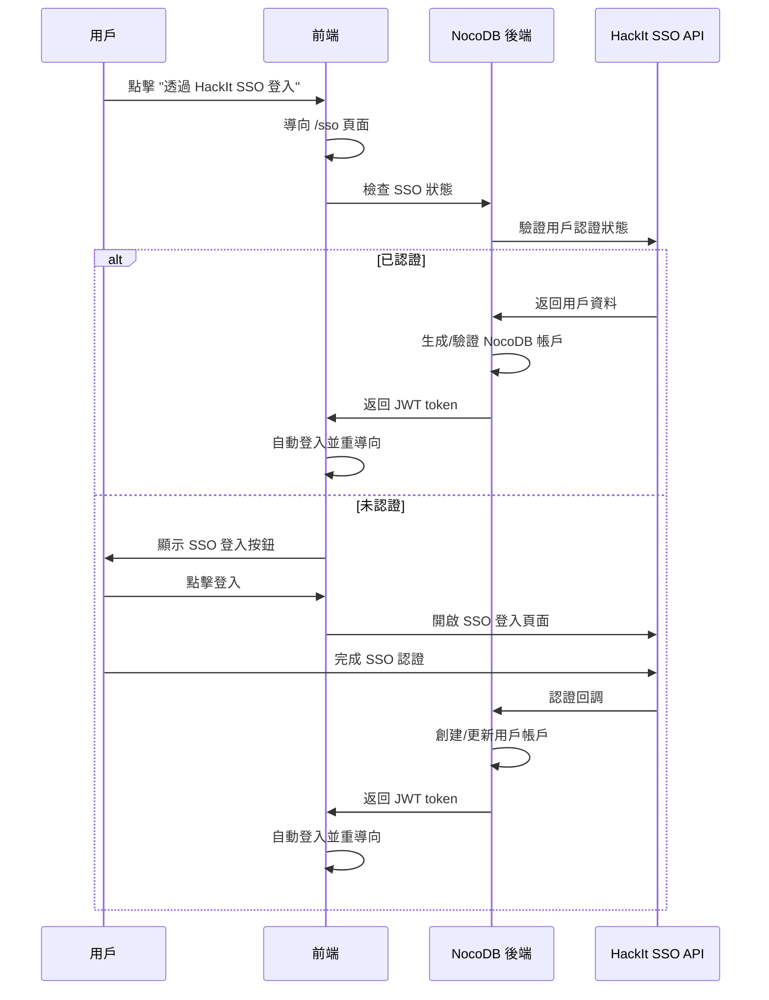

# HackIt SSO 整合設定指南

本文件說明如何設定和使用 HackIt SSO 整合功能。

## 功能概述

HackIt SSO 整合提供以下功能：

1. **單一登入體驗**：用戶可以使用 HackIt 帳戶直接登入 NocoDB
2. **自動帳戶創建**：首次 SSO 登入時自動創建 NocoDB 帳戶
3. **安全密碼生成**：基於用戶資料生成唯一且確定性的密碼
4. **個人資料同步**：從 HackIt SSO 同步用戶個人資料和標籤
5. **無縫整合**：不需要額外的依賴或大規模架構變更

## 環境設定

### 1. 環境變數配置

在 `.env` 檔案中添加以下設定：

```bash
# HackIt SSO Configuration
HACKIT_SSO_API_BASE=https://api.hackit.tw
HACKIT_SSO_API_KEY=your-hackit-sso-api-key-here
HACKIT_SSO_PASSWORD_SALT=your-unique-salt-for-password-generation
```

### 2. 環境變數說明

- **HACKIT_SSO_API_BASE**: HackIt SSO API 的基礎 URL
- **HACKIT_SSO_API_KEY**: HackIt SSO API 金鑰，用於 HMAC 認證
- **HACKIT_SSO_PASSWORD_SALT**: 用於生成確定性密碼的鹽值（請設定為唯一值）

### 3. 獲取 API 金鑰

請聯繫 HackIt 組織管理員獲取 API 金鑰。API 金鑰將用於：

- 向 HackIt SSO API 進行認證
- 獲取用戶資料
- 驗證用戶身份

## 技術實現

### 1. 密碼生成機制

為了滿足不訪問資料庫但需要安全密碼的需求，系統使用以下機制：

```javascript
// 確定性密碼生成公式
const userData = [
  user.email.toLowerCase(),
  user.user_id.toString(),
  user.guild_id.toString(),
  user.id,
  HACKIT_SSO_PASSWORD_SALT
].join('|')

const password = HMAC-SHA256(HACKIT_SSO_PASSWORD_SALT, userData).substring(0, 32)
```

**安全特性**：
- ✅ 每個用戶都有唯一密碼
- ✅ 相同用戶每次生成相同密碼（確定性）
- ✅ 使用 HMAC-SHA256 確保高安全性
- ✅ 包含鹽值防止彩虹表攻擊
- ✅ 密碼長度為 32 字元，滿足強度要求

### 2. 認證流程



### 3. API 端點

- `GET /api/auth/hackit-sso/check` - 檢查 SSO 認證狀態
- `POST /api/auth/hackit-sso/login` - 發起 SSO 登入
- `POST /api/auth/hackit-sso/callback` - 處理 SSO 回調

## 用戶體驗

### 1. 登入流程

1. 用戶訪問 NocoDB 登入頁面
2. 系統自動檢查 HackIt SSO 狀態
3. 如果已認證，自動登入
4. 如果未認證，顯示 "透過 HackIt SSO 登入" 按鈕
5. 用戶點擊後導向專用 SSO 頁面
6. 完成 HackIt 認證後自動返回 NocoDB

### 2. 帳戶創建

首次 SSO 登入時，系統會：

- 使用 HackIt email 作為 NocoDB 帳戶 email
- 生成安全的確定性密碼
- 同步用戶個人資料（姓名、bio、位置等）
- 同步用戶標籤
- 設定適當的用戶角色

### 3. 後續登入

後續登入時，系統會：

- 驗證 SSO 認證狀態
- 更新用戶資料（如有變更）
- 生成新的 JWT token
- 自動登入用戶

## 安全考量

### 1. 認證安全

- ✅ 使用 HMAC-SHA256 進行 API 認證
- ✅ 時間戳驗證防止重放攻擊
- ✅ HTTPS 加密傳輸
- ✅ HttpOnly Cookie 存儲 SSO 會話

### 2. 密碼安全

- ✅ 不在前端暴露任何密碼資訊
- ✅ 使用強加密演算法生成密碼
- ✅ 密碼對用戶不可見且不可預測
- ✅ 包含鹽值提高安全性

### 3. 會話管理

- ✅ SSO 會話與 NocoDB 會話分離
- ✅ 支援單一登出
- ✅ 會話過期自動處理

## 疑難排解

### 1. 常見問題

**Q: SSO 登入失敗怎麼辦？**
A: 檢查以下項目：
- 環境變數是否正確設定
- API 金鑰是否有效
- 網路連線是否正常
- HackIt SSO 服務是否可用

**Q: 密碼如何重置？**
A: SSO 用戶的密碼由系統自動管理，不需要手動重置。如需重置，請重新進行 SSO 認證。

**Q: 如何退出 SSO？**
A: 系統會自動處理 SSO 登出，同時清除相關 Cookie 和會話。

### 2. 除錯資訊

啟用除錯模式查看詳細日誌：

```bash
# 設定 Node.js 除錯等級
DEBUG=hackit-sso:* npm start
```

### 3. 日誌位置

- SSO 認證日誌：`/var/log/nocodb/sso.log`
- 系統錯誤日誌：`/var/log/nocodb/error.log`

## 維護和更新

### 1. 定期任務

- 定期檢查 API 金鑰有效性
- 監控 SSO 認證成功率
- 檢視用戶同步狀態

### 2. 安全更新

- 定期更新密碼鹽值（如需要）
- 監控安全漏洞
- 更新相關依賴

## 支援和聯繫

如有問題或需要協助，請聯繫：

- **技術支援**: 請在 GitHub 建立 Issue
- **API 金鑰**: 聯繫 HackIt 組織管理員
- **安全問題**: 請私下聯繫開發團隊

---

**注意**: 本整合遵循最小依賴原則，不會對現有 NocoDB 架構造成重大變更，確保穩定性和維護性。 